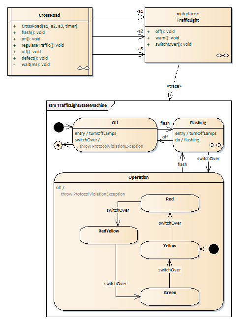
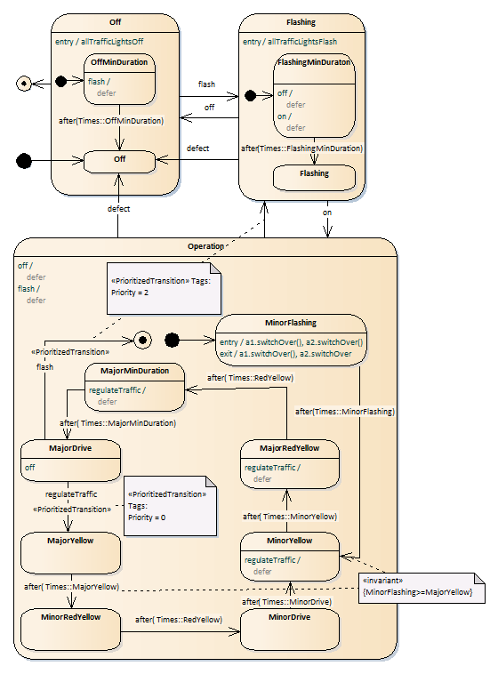
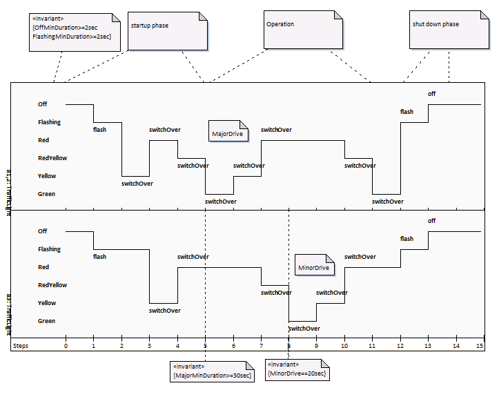

# CrossRoad

## Purpose

this Library simulates a third party component to be buyed in the context of the make or buy decision.

right click and save link as...: [download
model](https://github.com/GerdHirsch/TrafficControlSystem/raw/master/CrossRoadLib/Model/CrossRoadLib.xml) to
be imported in Enterprise Architect.

## Tests

can be found in [CrossRoadCUTE](/CrossRoadCUTE)

## Contract

The CrossRoad requires a Timer object and three TrafficLight objects with the depicted Interface and Contract
below:

## CrossRoad Behaviour

The behavior of the crossroad is shown in the CrossRoadStateMachine diagram below:

## Timing

An example Timing Diagram is shown below:

