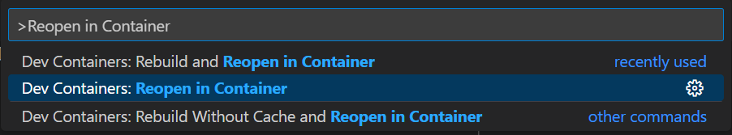
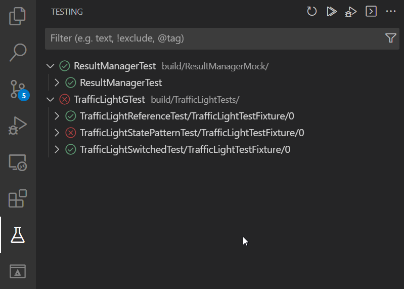

# TrafficControlSystem

## Content

This repository contains the sources for the workshop series "Object Oriented
Analysis with UML" and the series "Object Oriented Design and Design Patterns".

There is a separate description for each component.

- [Intersection aka CrossRoad](./CrossRoadLib/CrossRoad.md)
- [Sensor](./Sensor/Sensor.md)
- [TrafficControlSystem](./TrafficControlSystem/TrafficControlSystem.md)
- [PeriodicTimer](https://github.com/GerdHirsch/PeriodicTimer/blob/master/README.md)

## Models

to download the EA model for the libraries choose:
`<_projectname_>/Model/<_libname_>.xmi` right click on Raw -> save link as.. and
import the xmi file into EA

## Build the examples

Prerequisites:

- VSCode
- Docker + "Dev Containers" Extension
- Internet Connection

[Open the command palette in VSCode](https://googlethatforyou.com?q=How%20to%20open%20the%20command%20palette%20in%20VSCode) and select `Reopen in Container`.

You are now working inside a **DevContainer**! To start the build, select `Run Build Task` from the command palette.

To run the unittests, select `Run Test Task` from the command palette.
Alternatively, you can use the graphical test explorer on the left side of VSCode.

