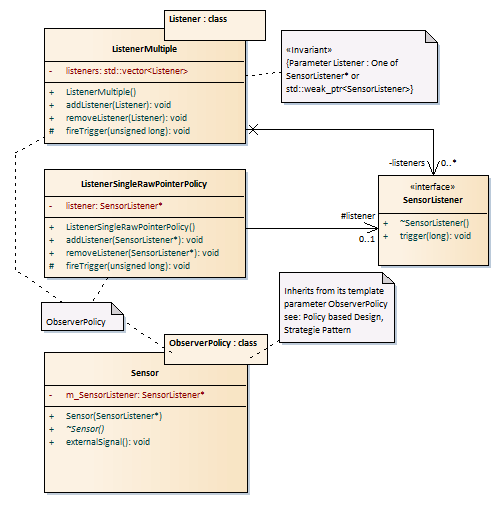

# Sensor

## Purpose

Sensor is a Header only Library. It simulates a third party component to be
buyed in the context of the make or buy decision. right click and save link
as...: [download
model](https://github.com/GerdHirsch/TrafficControlSystem/raw/master/Sensor/Model/Sensor.xml)
to be imported in Enterprise Architect.

This component simulates a sensor that communicates with a Hardware Sensor. To
simulate the Hardware Event just call `externalSignal()`.

## Observer Pattern

The communication with the sensor is based on the Observer Pattern. The Observer
is called SensorListener in reference to the java API.

## Policy Based Design

The management of the observers is based on "Policy Based Design" according to
Alexandrescu, a static variant of the strategy pattern. Sensor inherits in this
design from its template parameter ObserverPolicy:

```
template<class ObserverPolicy>
class Sensor : public ObserverPolicy
{
    ...
};
```

With this technique, the interface of the sensor is extended by the interface of
the ObserverPolicy and is available to the clients.

Two policies are provided for the ObserverPolicy:

* The ListenerSingleRawPointerPolicy manages one listener as a native pointer
  SensorListener*.
* The ListenerMultiple policy manages a list of listeners either as native
  pointer SensorListener* or as std::weak_ptr\<SensorListener\>. The type is
  passed to the policy as a template argument.

An ObserverPolicy must meet two conditions: a default constructor and an
accessible (`protected`) `fireTrigger(unsigned long timestamp) `method.



## Examples and Implementation

Examples can be found in
[main.cpp](https://github.com/GerdHirsch/TrafficControlSystem/blob/master/Sensor/main.cpp)
in `demoSingleRawPointer()`, in `demoMultipleRawPointer()` and in
`demoMultipleSmartPointer()`.

The Implementations can be found in
[include/Sensor](https://github.com/GerdHirsch/TrafficControlSystem/tree/master/Sensor/include/Sensor)
`Sensor.h` and in `ListenerSingleRawPointer.h` and in `ListenerMultiple.h`